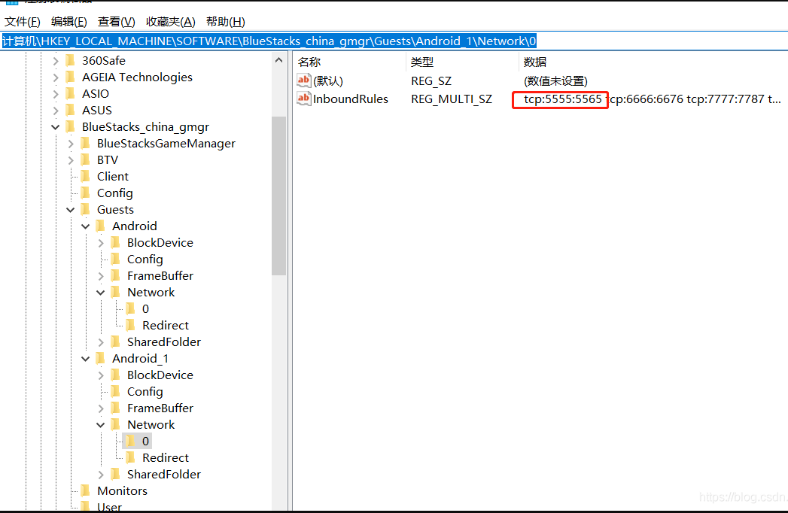

# 编程开发

[[toc]]

## 其他

代码在线运行<http://www.dooccn.com/java/>

## 开发工具/相关资源下载

Android 开发所需环境、工具（很全）
包含了 Android 开发所需要的环境、在线小工具、开发神器、辅助工具、开发文档、学习教程。提供 SDK 、AndroidSudio、 ADT、Gradle 等等各个版本的下载。  
<http://androidblog.cn/tools/>  
NDK 下载<https://developer.android.google.cn/ndk/downloads/>

## md5 加密解密

<http://www.cmd5.com/>

## 经纬度定位

<http://www.gpsspg.com/maps.htm>

## 代码比较

<https://www.diffchecker.com/>

### beyond compare

```
方法一：
修改C:\Program Files\Beyond Compare 4\BCUnrar.dll,这个文件重命名或者直接删除，则会新增30天试用期，再次打开提示还有28天试用期
方法二：
1.cmd窗口输入regedit,打开注册表。
2.删除项目：计算机\HKEY_CURRENT_USER\Software\ScooterSoftware\BeyondCompare4\CacheId
如果你没有看到cacheId,使用方法三。
方法三：
我是win10也没有cacheld，然后我找到 C:\Users\你的用户\AppData\Roaming\BCompare\BCompare.ini 打开一下软件（是否成功无所谓） 把InstallTime后的值改成LastLoading后的值就能打开了

其中方法三最有效，可以直接尝试方法三
```

### postman

```
问题1、请求https没反应?
settting  - 关闭 SSL certificate verification
```

### 替代 postman

<https://paw.cloud>

## 数据库工具

查看<https://sqlitebrowser.org/>

## ftp 工具

ftp,ftps,sftp<https://filezilla-project.org/>
winscp  
DaRemote：手机端

## editplus

注册码在线生成<https://www.jb51.net/tools/editplus/>

## emeditor

打开超大文件

## notepad++

```
C:\Users\Administrator\AppData\Roaming\Notepad++\backup
里面的文件就是你的自动保存的缓存文件。
C:\Users\Administrator\AppData\Roaming\Notepad++\session.xml

里面记录了缓存文件的位置，打开后如果没有看到文件地址，那是因为你没有内容被Notepad++缓存，打开Notepad++，新建文档，随便输入点东西，就可以看到地址了。
```

- 将文本所有\n 换行

```
查找目标：\\n
替换为:\r
选择循环查找
模式改为正则表达式

```

## genymotion

Genymotion-ARM-Translation.zip 各安卓版本合集  
<https://www.jianshu.com/p/97b8250f359e>

Genymotion_ARM_Translation 各版本  
<https://github.com/m9rco/Genymotion_ARM_Translation>

Unable to start the virtual device.VirtualBox cannot start the virtual device  
<https://blog.csdn.net/u012400885/article/details/53689045>  
android studio 识别不到 genymotion device  
点击 settings -- 点击 ADB，设置 sdk 位置，选择 Use custom Android SDK tools，选择 Android SDK 的位置 -- 重启

### "Unable to start the virtual device" (Windows 10) – Genymotion

<https://support.genymotion.com/hc/en-us/articles/360003592938--Unable-to-start-the-virtual-device-Windows-10->

## 在线 android、ios 模拟器

<https://appetize.io/>

### bluestack 蓝叠模拟器

- 共享文件夹

```
1.打开模拟器右上角倒三角-》设置-》引擎设置：点击 ”获取Root权限”, 然后点击确定关闭设置窗口
2.打开模拟器首页-》系统应用-》多媒体管理器，点击” Import Form Windows” 从电脑选择需要导入的文件并导入。
3.打开模拟器首页-》系统应用-》R.E.管理器-》sdcard/DCIM/SharedFolder
```

- 连接

```
adb connect 127.0.0.1:5555
adb reverse tcp:8081 tcp:8081

由于蓝叠模拟器可以多开，及可同时运行很多多开的模拟器。使用adb可以一对一进行连接，多开用的是不同的adb端口。
步骤：
1.打开蓝叠模拟器adb调试（就版本不一定有这勾选项目，没有就跳过）
　　模拟器右上有一个倒三角▼-->设置-->引擎设置-->勾选“允许ADB连接”
　　可能需要重启模拟器
2.找到打开的端口
　　1）打开注册表
　　　　win+R 打开运行
　　　　输入regedit后回车
　　2）定位到如下位置
计算机\HKEY_LOCAL_MACHINE\SOFTWARE\BlueStacks_china_gmgr\Guests\Android_1\Network\0

如图下图
```



## 思维导图

xmind<https://www.lanzous.com/i7wyxof>

## ps 在线工具

[PS1](https://toolwa.com/ps/)
[PS2](https://ps.gaoding.com/#/)

## photoshop 破解版

<http://adobe.v404.cn/adobe/>  
<https://hao.su/3101/>

## 投屏，无线连接 adb

<https://gitee.com/Barryda/QtScrcpy>

## windows 快捷键

```
//反向tab
shift + tab
```

## 爬虫

微博<https://github.com/dataabc/weiboSpider>

### 接口文档管理工具

<https://easydoc.xyz/>  
<https://www.showdoc.cc/>  
<https://www.eolinker.com/#/> -支持 websocket，功能界面有点混乱  
<http://apizza.cc/> --支持 websocket，推荐  
<http://apijson.cn> 需部署  
<https://www.iminho.me/> 需部署

### 接口调试工具

打点调试接口  
<https://www.endpoints.dev/>

### 免费 api 接口

小白 api
<http://open.yesapi.cn/>  
虚拟用户信息
<https://randomuser.me/>  
占位图（自定义尺寸）  
<https://placeimg.com/>  
<https://source.unsplash.com/>

## VMware
- 安装unbuntu卡死问题: 新建时去掉打印机硬件
- 解决VMware虚拟机报错“无法连接MKS：套接字连接尝试次数太多，正在放弃”: 
  - 打开"我的电脑"->"管理"->"服务和应用程序"->"服务"
  - 右键启动以下服务:
    - VMware Authorization Service
    - VMware DHCP Service
    - VMware NAT Service
    - VMware USB Arbitration Service
    - VMware Workstation Server
- 开机时出错: 另一个程序已锁定文件的一部分，进程无法访问:
  - 进入虚拟机文件夹，删除以“.lck”为后缀的文件和文件夹
### Wireshark
Wireshark 是一个功能强大的网络抓包工具，在分析网络通信时非常有用。
- [Wireshark 官方网站](https://www.wireshark.org/)
- [Wireshark 过滤器显示关键字](https://www.crifan.com/wireshark_filter_display_keyword_for_weixin_http_request/)
- [抓包手机设置教程](https://www.jianshu.com/p/4a554f55fe9c)

### TCP/UDP 调试工具
- [sokit](https://github.com/ideawu/ssdb/wiki/sokit)

### 抓包工具
手机端抓包工具：
- [HttpCanary](https://www.getapkfree.com/apps/httpcanary-capture-analysis.html)
- [NetKeeper](https://www.netkeeperchina.com/)
- [chuck](https://github.com/jgilfelt/chuck)

### Charles
Charles 是一款功能强大的跨平台抓包工具，可用于分析和修改网络请求。
- [Charles 官方网站](https://www.charlesproxy.com/)
- [Charles 破解方法](https://www.cnblogs.com/findyou/p/3491014.html)
